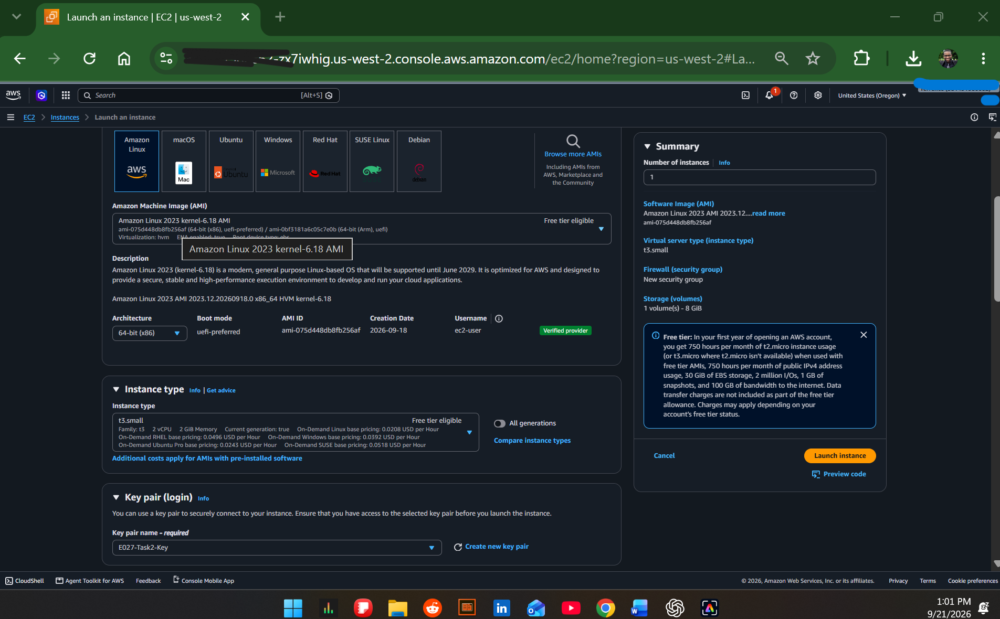
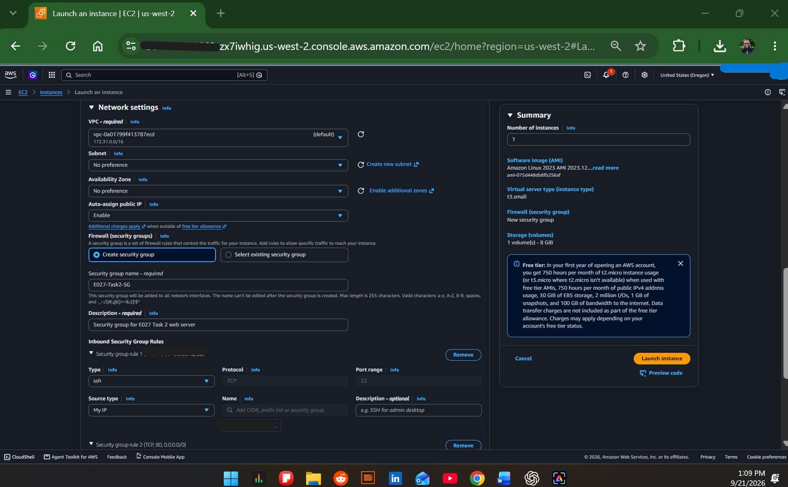
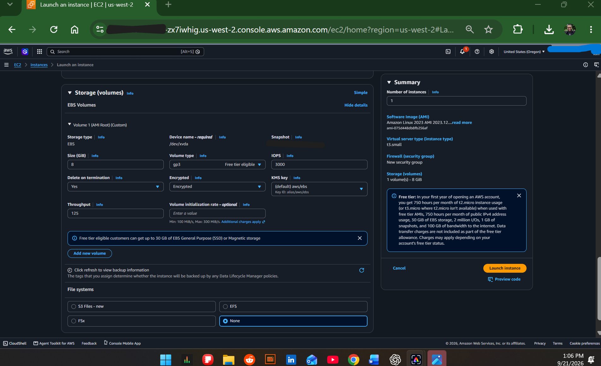
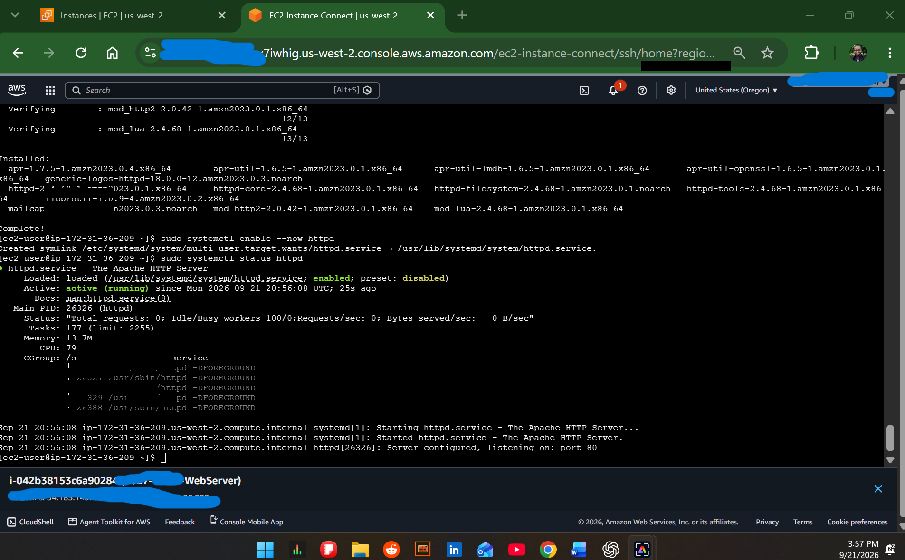
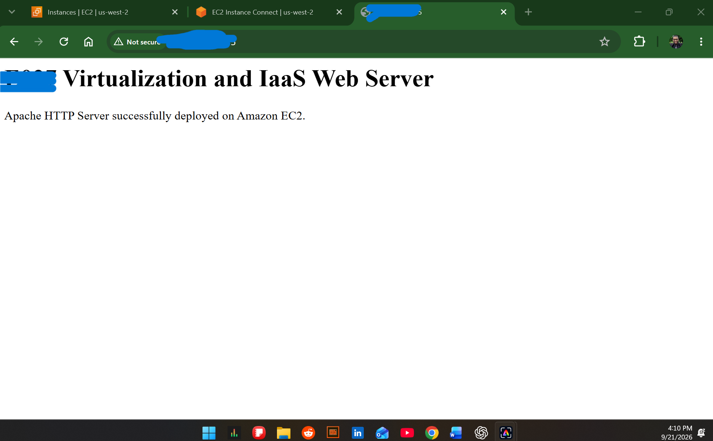
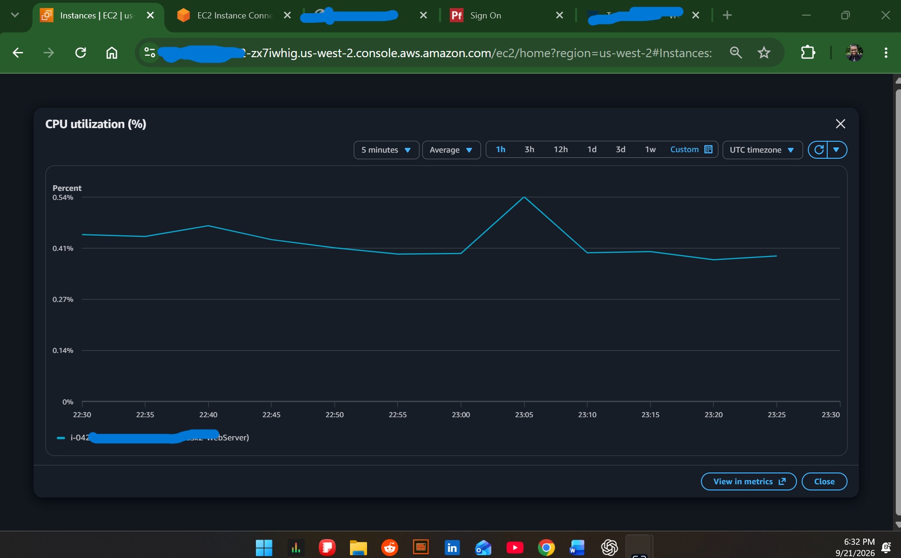
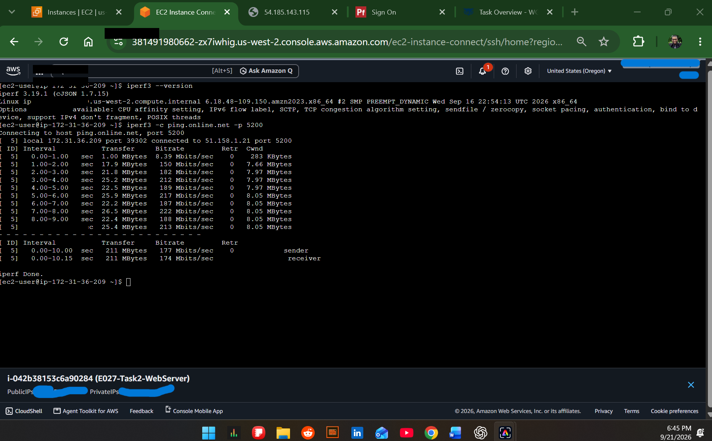

# AWS IaaS Cloud Infrastructure Deployment

## Project Overview

This project demonstrates the deployment and configuration of a Linux-based web server in Amazon Web Services (AWS) using Infrastructure as a Service (IaaS). The environment was built using Amazon EC2 and configured to provide web services, network connectivity, storage, monitoring, and alerting.

## Technologies Used

- Amazon Web Services (AWS)
- Amazon EC2
- Amazon Linux 2023
- Amazon EBS (gp3)
- AWS Security Groups
- Apache HTTP Server
- Amazon CloudWatch
- Linux
- SSH
- TCP/IP Networking

## What I Implemented

- Launched and configured an Amazon EC2 instance running Amazon Linux 2023.
- Configured EBS storage for the virtual server.
- Configured security group rules for SSH and HTTP traffic.
- Installed and configured the Apache HTTP web server.
- Deployed and verified a functioning webpage.
- Tested network connectivity and routing from the Linux server.
- Verified web-server listening ports and services.
- Performed network performance testing using iperf3.
- Monitored CPU utilization and network activity with Amazon CloudWatch.
- Configured a CloudWatch alarm to monitor CPU utilization.

## Skills Demonstrated

Cloud Infrastructure • AWS • Linux Administration • IaaS • Networking • Web Server Administration • Security Groups • Cloud Monitoring • Troubleshooting

## Project Implementation Screenshots

The following screenshots document the configuration, deployment, monitoring, and testing of the AWS EC2 web server environment.

### 1. EC2 Instance Configuration

Configured an Amazon EC2 instance using Amazon Linux 2023 and a `t3.small` instance type.

### 2. Security Group Configuration

Configured security group rules to permit SSH administration and HTTP traffic to the web server.

### 3. EBS Storage Configuration

Configured an 8 GiB `gp3` EBS volume with encryption, 3,000 IOPS, and 125 MB/s throughput.

### 4. Apache Web Server Service

Installed Apache HTTP Server on Amazon Linux and verified that the `httpd` service was active and running.

### 5. Web Server Deployment

Successfully deployed and accessed the Apache-hosted webpage from the EC2 instance.

### 6. CloudWatch CPU Monitoring

Used Amazon CloudWatch to monitor CPU utilization for the EC2 instance.

### 7. Network Performance Testing

Used `iperf3` from the Linux server to test network performance and verify network throughput.

## Project Outcome

This project provided hands-on experience deploying and administering cloud infrastructure in AWS. I configured compute, storage, networking, security, monitoring, and a Linux-based web server, then validated the environment through service verification and network performance testing.
