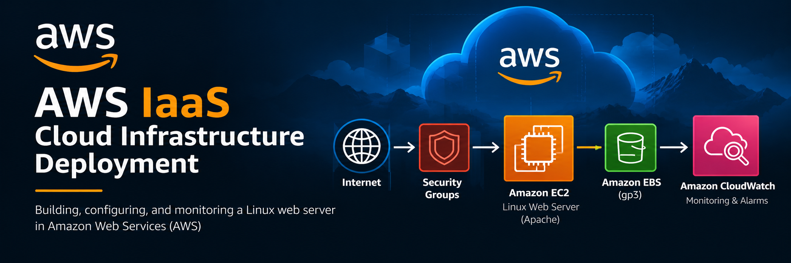

# AWS IaaS Cloud Infrastructure Deployment

## Project Overview

This project demonstrates the deployment and configuration of a Linux-based web server in Amazon Web Services (AWS) using Infrastructure as a Service (IaaS). The environment was built using Amazon EC2 and configured to provide web services, network connectivity, storage, monitoring, and alerting.

## Technologies Used

- Amazon Web Services (AWS)
- Amazon EC2
- Amazon Linux 2023
- Amazon EBS (gp3)
- AWS Security Groups
- Apache HTTP Server
- Amazon CloudWatch
- Linux
- SSH
- TCP/IP Networking

## What I Implemented

- Launched and configured an Amazon EC2 instance running Amazon Linux 2023.
- Configured EBS storage for the virtual server.
- Configured security group rules for SSH and HTTP traffic.
- Installed and configured the Apache HTTP web server.
- Deployed and verified a functioning webpage.
- Tested network connectivity and routing from the Linux server.
- Verified web-server listening ports and services.
- Performed network performance testing using iperf3.
- Monitored CPU utilization and network activity with Amazon CloudWatch.
- Configured a CloudWatch alarm to monitor CPU utilization.

## Skills Demonstrated

Cloud Infrastructure • AWS • Linux Administration • IaaS • Networking • Web Server Administration • Security Groups • Cloud Monitoring • Troubleshooting
